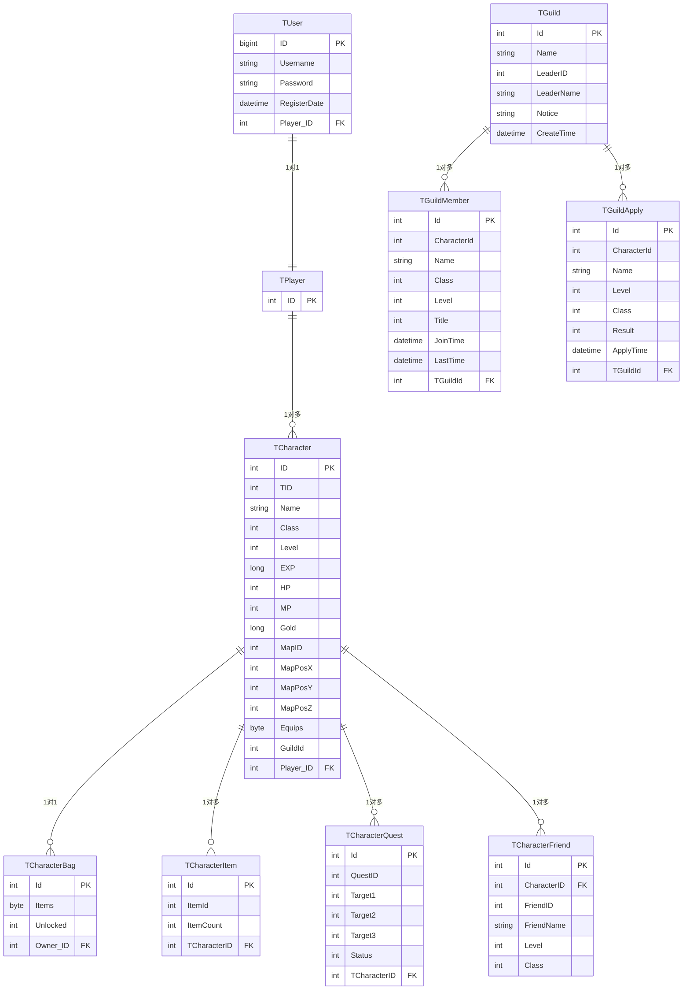

# 《极世界》MMORPG

基于 **Unity 2022.3 + .NET** 全栈开发的 MMORPG 项目，涵盖客户端/服务器/共享库，实现角色、战斗、社交、道具、任务等核心玩法系统。

    

## 项目架构

```
┌──────────────────────────────────────────────────────────┐
│                      Client (Unity)                       │
│  ┌────────────────────────────────────────────────────┐  │
│  │  HotUpdate (可热更)                                │  │
│  │  UI │ Manager │ Service │ Entity │ Battle          │  │
│  ├────────────────────────────────────────────────────┤  │
│  │  Core (不可热更)                                    │  │
│  │  NetClient │ AssetBundle │ EventSystem             │  │
│  └────────────────────────────────────────────────────┘  │
│                         │                                 │
│              Protobuf / TCP 长连接                        │
│                         │                                 │
│  ┌────────────────────────────────────────────────────┐  │
│  │                     Server (.NET)                   │  │
│  │  Service Layer (消息处理)                            │  │
│  │  Manager Layer (业务逻辑)                            │  │
│  │  Entity Layer (运行时实体)                           │  │
│  │  EF Core + SQL Server                               │  │
│  └────────────────────────────────────────────────────┘  │
│                                                          │
│  ┌────────────────────────────────────────────────────┐  │
│  │                Common (共享库)                       │  │
│  │  DataDefine │ Network │ Battle DataStruct          │  │
│  └────────────────────────────────────────────────────┘  │
└──────────────────────────────────────────────────────────┘
```

### 客户端

客户端代码通过 Assembly Definition 分割为两个程序集，Core → HotUpdate 单向依赖：

| 程序集 | 定位 | 内容 |
|--------|------|------|
| `Core` | 不可热更 | `NetClient` TCP 网络栈、AssetBundle 加载框架、`EventManager` 全局事件系统 |
| `HotUpdate` | 可热更 | 全部 UI、Manager、Service、Entity、Battle 表现层 |

### 服务器

| 层 | 职责 | 代表类 |
|----|------|--------|
| Service | 网络消息处理，订阅特定 Protobuf 消息 | `UserService`, `ChatService`, `BattleService`, `ItemService`, `ArenaService` |
| Manager | 游戏逻辑管理 | `MapManager`, `EntityManager`, `BattleManager`, `QuestManager`, `ArenaManager` |
| Entity | 运行时实体 | `Character`, `Monster`, `BattleUnit` |

通过反射扫描 `IInitializable` 实现类自动注册所有 Service/Manager。主循环 10 FPS 驱动 `MapManager.Update()`。

### 共享库 — Common

Common 库同时被客户端和服务器引用：

- `Common.Data` — 配置表 C# Define（`CharacterDefine`, `SkillDefine`, `BuffDefine`, `ItemDefine` 等）
- `Common.Network` — `PackageHandler`（帧协议封包/解包）、`MessageDistributer`（8 线程线程池分发）、`MessageDispatch`（消息路由）
- `Common.Battle` — `AttributeData` 属性结构、Buff/Skill 枚举
- `Common.GameInterFace` — `IInitializable` 接口

### 目录结构

```
├── Src/
│   ├── Lib/
│   │   ├── proto/              # Protobuf 协议定义 (13 个 .proto)
│   │   ├── Protocol/           # 生成的消息类
│   │   └── Common/             # 共享库（Data/Network/Battle/GameInterFace）
│   ├── Client/                 # Unity 客户端
│   │   └── Assets/Scripts/
│   │       ├── Core/           # 不可热更底层（网络/资源/事件）
│   │       └── HotUpdate/      # 可热更逻辑（UI/Manager/Service/Entity/Battle）
│   ├── Server/GameServer/      # .NET 服务器
│   │   ├── Services/           # 消息处理层
│   │   ├── Managers/           # 业务逻辑层
│   │   ├── Entities/           # 运行时实体
│   │   ├── Battle/             # 战斗计算
│   │   ├── Ai/                 # 怪物 AI
│   │   └── Pathfinding/        # 寻路系统
│   └── Data/                   # Excel 配置 + JSON + 转换工具
├── Art/                        # 美术资源
├── Doc/                        # 设计文档
└── Tools/                      # 构建/部署/Protobuf 生成工具
```

## 技术基础设施

### HybridCLR 代码热更新

采用 HybridCLR 实现原生 C# 热更新，运行时动态替换 HotUpdate 程序集：

- 在 IL2CPP 基础上扩展解释执行，通过补充 AOT 元数据使解释器加载运行时 DLL
- 热更新流程：构建 HotUpdate.dll → 上传 CDN → 客户端启动拉取 → 运行时加载替换
- 解决了 AOT/解释器混合模式下的泛型共享和值类型传递兼容性问题

### AssetBundle 资源管理框架

自研完整的 AssetBundle 生命周期管理：

| 模块 | 功能 |
|------|------|
| `BundleManager` | 按模块维护依赖关系图，管理包加载/卸载 |
| `BundleAsync` / `ABundleAsync` | 异步加载 |
| `AResource` / `AutoUnload` | 引用计数 + 自动卸载 |
| `HotUpdateManager` + `ABDownloader` | 增量下载 + MD5 完整性校验 |

解决了异步加载链中的依赖解析和场景切换时资源的正确回收问题。

### 网络通信框架

自定义 TCP 二进制帧协议，Common 库定义共享网络层，客户端和服务器共用 `PackageHandler`、`MessageDistributer`、`MessageDispatch`：

```
┌──────────────────┬──────────────────────┐
│  4 字节 Length    │  Protobuf 序列化体    │
│  (小端序 int32)   │                      │
└──────────────────┴──────────────────────┘
```

**协议规模**：13 个 `.proto` 文件，31 种 RPC 请求 / 35+ 种响应，通过 `message.proto` 的 NetMessage 信封统一包装。

#### 共享网络层（Common.Network）

| 组件 | 职责 |
|------|------|
| `PackageHandler<T>` | 4 字节长度前缀帧协议的封包/解包。`ReceiveData()` 写入 MemoryStream（64KB），`ParsePackage()` 递归解析完整帧 → Protobuf 反序列化 → 入队到 `MessageDistributer`；`PackMessage()` 反向序列化 + 写长度前缀 |
| `MessageDistributer<T>` | 线程池消息分发。维持 `messageQueue` 和 `messageHandlers` 字典（消息类型 → 委托），`Subscribe<Tm>()` / `Unsubscribe<Tm>()` 管理订阅。多线程模式 `Start(n)` 启动 n 个线程池工作线程，`AutoResetEvent` 等待消息到达后出队分发 |
| `MessageDispatch<T>` | 消息路由。`Dispatch()` 遍历 `NetMessageRequest`/`NetMessageResponse` 的每个 oneof 字段，命中后调用 `MessageDistributer.RaiseEvent()` 触发订阅回调 |

#### 服务端

```
TcpSocketListener.AcceptAsync()
  └── NetService.OnSocketConnected
        └── new NetConnection<NetSession>(socket)
              ├── BeginReceive() → ReceiveAsync 循环
              │     └── PackageHandler.ReceiveData()
              │           └── ParsePackage() → MessageDistributer.ReceiveMessage()
              │                 └── 8 线程工作线程 → MessageDispatch.Dispatch()
              │                       └── handler(sender, message) → Service 回调
              └── SendResponse() → BeginSend()
```

- **`TcpSocketListener`**：封装 `Socket.Bind()` + `Listen()`，循环 `AcceptAsync()`，每次接受触发 `SocketConnected` 事件
- **`NetService`**：启动枢纽。`Init()` 创建监听器并挂载 `OnSocketConnected` 回调；`Start()` 启动监听和 8 线程 `MessageDistributer`
- **`NetConnection<NetSession>`**：单连接管理。构造时分配 64KB 接收缓冲区，调用 `BeginReceive()` → `socket.ReceiveAsync()` 循环；收到 0 字节或异常则 `CloseConnection()` 并触发 `DisconnectedCallback`
- **`NetSession`**：连接会话，持有 `TUser`、`Character`、`NEntity`、`IPostResponser`。`Response` 属性懒创建 `NetMessageResponse`，`DisConnected()` 调用 `UserService.CharacterLeave()` 处理离线

#### 客户端

```
NetClient.Update()（每帧驱动）
  ├── ProcessRecv() → socket.Receive() → PackageHandler.ReceiveData()
  │     └── ProceeMessage() → MessageDistributer.Distribute()（单线程排空队列）
  ├── ProcessSend() → sendQueue 出队 → PackageHandler.PackMessage() → socket.Send()
  └── KeepConnect() → 断线检测 → Connect() 重连
```

- **`NetClient`**：Unity 单例，`Update()` 每帧驱动全部网络 IO。`Connect()` 异步连接（10 秒超时），失败最多重试 3 次
- **断线重连**：`KeepConnect()` 检测连接断开 → `Connect()` 重试（3 次 / 10 秒间隔），超过上报 `NET_ERROR_FAIL_TO_CONNECT`
- **心跳保活**：30 秒间隔 Ping
- **双缓冲**：`sendBuffer` + `sendQueue` 分离序列化和实际发送

#### 完整数据流

```
Client SendMessage()
  → sendQueue → ProcessSend() → socket.Send()
     → Server TcpSocketListener → NetConnection.ReceiveAsync()
        → PackageHandler.ReceiveData() → MessageDistributer.ReceiveMessage()
           → 工作线程 → MessageDispatch.Dispatch() → Service 回调
              → session.Response → NetConnection.SendResponse()
                 → Client ProcessRecv() → MessageDistributer.Distribute() → UI 刷新
```

### 事件系统

`EventManager` 全局发布/订阅，UI 与逻辑层、模块间通过事件通信，支持运行时模块热插拔。

### UI 框架

基于 `UIWindow` 抽象基类的面板管理系统：

- **`UIWindow`**：所有面板的基类，提供 `Close()` 方法和 `OnClose` 委托（`WindowResult` 枚举：None/Yes/No）
- **`UIManager`**：单例面板管理器，构造时注册面板类型到 Prefab 路径映射。`Show<T>()` 加载 Prefab 实例化到 `UIMain` 根画布，`Close()` 销毁释放内存
- **`UIMain`**：常驻根画布，按钮点击通过 `UIManager.Instance.Show<T>()` 命令式打开面板
- **数据绑定**：面板在 Unity `Start()` 中手动订阅 Service 事件或 `EventManager` 全局事件

实现了 16 个功能面板：登录注册、角色选择、主界面、背包、装备、技能、聊天、好友、公会（列表/申请/成员/信息）、组队、任务（对话/信息/物品/状态）、商店、坐骑、小地图、角色信息、设置。

### 配置数据管线

```
Excel (.xlsx) ──json-excel──▶ JSON (.txt) ──自动复制──▶ 客户端 (AssetBundle/Data/) + 服务器 (GameServer/Data/)
                                    │
                         Common.Data/*Define.cs（C# 类作为反序列化 Schema）
```

- `Excel2Json.cmd` 一键转换，自动分发到客户端和服务器
- `DataManager` 以 `Dictionary<int, T>` 加载全部配置表，TID 为键 O(1) 查询
- 配置类型：角色、地图、技能、Buff、物品、任务、商店、公会

## 社交系统

### 聊天

- **世界频道**：消息广播到当前地图全部玩家
- **私聊**：点对点，通过 Session 直接投递到目标玩家
- `UIChat` 面板支持频道切换和聊天记录

### 好友

- 添加好友：发送请求 → 服务端转发目标 → 对方确认 → 双向建立关系，写入 `TCharacterFriend` 表
- 删除好友：双向清理数据库记录

### 组队

- 邀请/接受/离开流程，加入前校验在线状态和已有队伍
- `TeamService` 处理消息，`TeamManager` 管理队伍状态，`UITeam` 展示成员

### 公会

- 创建：唯一名称校验，创建者自动成为会长
- 加入：申请 → 审批流程，`TGuildApply` 表记录申请状态
- 管理：晋升、踢出
- `UIGuild` 含列表、申请、成员、信息四个子面板

## 战斗系统

战斗以服务器 `Battle` 为权威，每个地图一个 `Battle` 实例，每 tick 处理一个战斗动作。双端共享 `SkillDefine`/`BuffDefine` 配置，服务器计算伤害和状态，客户端播放表现。

### 整体流程

```
客户端 BattleService.SendSkillCast(skillId, casterId, targetId, pos)
  → SkillCastRequest 发送到服务器

服务器 BattleService.OnSkillCast
  → BattleManager.ProcessBattleMessage(sender, msg)
    → Battle.ProcessBattleMessage() → 验证发送者身份 → 入队 _actions

服务器 Battle.Update() [每 tick 一个动作]
  ├── _actions 出队 → ExecuteAction(action)
  │     └── BattleContext 创建 → caster.CastSkill(context, skillId)
  │           ├── CanCast()：CD/射程/MP/目标有效性
  │           ├── Init()：设冷却、AddBuff(SkillCast 触发)
  │           └── 瞬发 → DoHit() / 有读条 → Casting → Running
  ├── UpdateUnits()：技能 CD 递减、Buff 计时、回收死亡单位
  └── BroadcastHitsMessage() → 广播 SkillCastResponse + SkillHitResponse + BuffResponse

客户端 BattleService.OnSkillCast → caster.CastSkill() → 播放动作/特效
客户端 BattleService.OnSkillHit  → caster.DoSkillHit()  → 扣血/弹字/命中特效
客户端 BattleService.OnBuff     → unit.DoBuffAction()   → 添加/移除 Buff 图标
```

### 技能

**客户端：**

- `BattleService.SendSkillCast(skillId, casterId, targetId, position)` 构建 `SkillCastRequest` 发送
- 收到 `SkillCastResponse` 后 `caster.CastSkill()` → `Skill.BeginCast()`：播放技能动画、面向目标、有读条进入 Casting 状态否则 `StartSkill()` 播放 AOE 特效
- `UISkill` 面板管理技能槽位和 Buff 图标

**服务器：**

- `Skill.Cast(context)` 执行完整施放流程：
  - `CanCast()` 校验：技能未在施放中、目标有效（非空/非自身）、射程内、MP 充足、CD 冷却
  - `Init()`：重置计时器和命中计数、设 CD、`AddBuff(TriggerType.SkillCast, target)` 应用"施放时触发"Buff
  - 瞬发技能直接 `DoHit()`；有 `CastTime` 则进入 Casting → Running 状态分帧执行
- **释放类型**：`Instant`（瞬发）、`Casting`（读条后命中）、`Running`（按 HitTimes 时间轴或 Interval/Duration 周期命中）
- **目标模式**：单体 / AOE（`HitRange()` 查找范围内所有单位逐个 `HitTarget()`）
- `SkillManager` 从配置加载技能，按角色等级解锁

### 伤害计算

`Skill.HitTarget(target, hitInfo)` → `CaculateDamage(caster, target)`：

```
ad_damage = caster.AD * (1 - target.DEF / (DEF + 100))
ap_damage = caster.AP * (1 - target.MDEF / (MDEF + 100))
总伤害 = (ad + ap) * 暴击判定(随机 < CRI 则 x2) * 随机浮动(±5%)，最小值 1
```

→ `target.DoDamage(damage, caster)` 扣 HP，HP ≤ 0 标记死亡。命中信息写入 `_hits` 列表广播。

### Buff

**服务器：**

- `Buff` 构造时 `OnAdd()`：修改单位属性（如 `DEFRatio`）、添加视觉效果、创建 `NBuffInfo(Action=Add)` 入队广播
- `Buff.Update()` 每 tick：间隔型按 `Interval` 周期 `DoBuffDamage()` 造成 DoT 伤害并广播 `Action=Hit`；到期 `OnRemove()` 还原属性、移除效果、广播 `Action=Remove`
- 触发时机：`TriggerType.SkillCast`（技能释放）、`TriggerType.SkillHit`（技能命中）
- 同类型 Buff 可叠加层数

**客户端：**

- `BattleService.OnBuff` 收到 `BuffResponse`，遍历 `NBuffInfo` 按 `Add/Remove/Hit` 分别处理：添加 Buff 图标、移除 Buff、扣血弹字

### 子弹（弹道）

**服务器：**

- `Skill.CastBullet(hitInfo)` 创建 `Bullet`：计算飞行时长 `duration = distance / BulletSpeed`，注册命中回调
- `Bullet.Update()` 每 tick 累加 `_flyTime`，到达 `_duration` 后调用 `_skill.DoHit(hitInfo)` (标记 `IsBullet=true`) → `Stoped = true`
- 服务器仅在释放时刻校验射程，飞行时间内目标可能已移动

**客户端：**

- 收到 `SkillCastResponse` 若含子弹信息，创建客户端 `Bullet` 表现飞行轨迹

### 广播与同步

每 tick `Battle.BroadcastHitsMessage()` 将本轮三类数据打包为一个 `NetMessageResponse` 通过 `Map.BroadcastBattleResponse()` 广播地图内全体客户端：

| 消息类型 | 内容 |
|----------|------|
| `SkillCastResponse` | 技能 ID、施法者、目标、位置、施放结果 |
| `SkillHitResponse` | 命中信息 + `NDamageInfo` 列表（目标、伤害值、是否暴击） |
| `BuffResponse` | `NBuffInfo` 列表（Action: Add/Remove/Hit） |

### 属性系统

`AttributeData` 定义在 Common 库双端共享，涵盖 HP、MP、AD、AP、DEF、MDEF、暴击率、暴击伤害。服务器执行计算，客户端同步表现。

### 状态同步

以服务器 Entity 为权威驱动，通过 `NEntitySync` 消息广播位置/方向/速度到全体客户端：

```
服务器 Map.UpdateEntity()
  ├── 写入源 Character 的 Entity.Position/Direction/Speed
  └── 广播 MapEntitySyncResponse 到地图其他角色

客户端 MapService.OnMapEntitySync()
  └── EntityManager.OnEntitySync()
        ├── Entity.SetEntityData() → 更新逻辑层 Position/Direction/Speed
        └── IEntityNotify.OnEntityChange() → 通知 EntityController

EntityController.Update()
  └── Entity.OnUpdate(delta) → Position += dir * Speed * delta / 100
       └── SyncEntityTransform()
             ├── 距离 > 5 单位 → 瞬移
             └── 否则 → 指数衰减平滑插值: t = 1 - exp(-20 * delta), Lerp(current, target, t)
```

- 服务器 `EntityManager` 统一管理实体 ID 注册和地图内空间查询
- 客户端 `EntityController` 按帧将逻辑位置平滑插值到 GameObject Transform
- 本地玩家由 `PlayerController` 直接响应输入，不走同步回路

### PVE 与怪物 AI

`Monster` 实体组合两个代理——`AIAgent` 负责行为决策，`PathfindingAgent` 负责移动执行。`Monster.Update()` 每帧调用两个代理，代理内部委托给具体的策略实现。

#### AIAgent — 行为代理

```
AIAgent
  └── AIBase _ai                    (具体行为策略)
        ├── Update()                (战斗循环)
        ├── OnDamage(source, amount) (受伤反应)
        └── ClearTarget()           (清除目标)
```

- **接口契约**：`AIBase` 作为抽象约定，提供 `Update()`、`OnDamage()`、`ClearTarget()` 等虚方法。子类覆写所需方法实现特定行为
- **运行时选择**：`AIAgent` 构造时从 `CharacterDefine.AI` 读取 AI 名称，switch 匹配 `public const string ID` 创建对应实例，默认 `AIMonsterPassive`
- **已实现类型**：

| AI 类型 | ID | 行为 |
|---------|-----|------|
| `AIMonster` | `"AIMonster"` | 基础，占位 |
| `AIMonsterPassive` | `"AIMonsterPassive"` | 被动怪，继承 AIBase 战斗循环 |
| `AIBoss` | `"AIBoss"` | Boss，继承 AIBase 战斗循环 |

- **战斗循环**：`AIBase.Update()` → 进战状态 → 优先 `TryCastSkill()` 释放可用技能 → 否则 `TryCastNormal()` 普攻 → 均超出射程则 `FollowTarget()` 追击

#### PathfindingAgent — 寻路代理

```
PathfindingAgent
  └── PathfindingBase _pathfinding    (具体寻路策略)
        ├── Update()                  (每帧移动计算)
        ├── MoveTo(target)            (设定目标)
        └── StopMove()                (停止移动)
```

- **接口契约**：`PathfindingBase` 抽象类，定义 `Update()`（抽象，必须实现）、`MoveTo()`（虚方法）、`StopMove()`（虚方法）
- **运行时选择**：`PathfindingAgent` 构造时从 `CharacterDefine.Pathfinding` 读取策略名，switch 匹配创建实例，默认 `PathfindingStraightLine`
- **当前实现**：`PathfindingStraightLine`——每帧直线向目标插值移动，按怪物速度移动，广播 `MoveFwd`/`Idle` 实体同步事件

#### 扩展与替换

AI 和寻路策略均可插拔替换，无需修改 Monster 代码：

```
新增 AI：  class MyAI : AIBase { public const string ID = "MyAI"; ... }
          → CharacterDefine.AI 配置 "MyAI" → AIAgent switch 匹配 → 实例化

新增寻路：class MyPF : PathfindingBase { public override void Update() { ... } }
          → CharacterDefine.Pathfinding 配置 "MyPF" → PathfindingAgent switch 匹配 → 实例化
```

代理只负责按名称分派，不包含业务逻辑。具体行为在子类中编码，配置表驱动运行时实例化。

### PVP 竞技

- 玩家发起挑战 → 转发目标 → 接受 → 创建竞技场实例
- `ArenaManager` 管理最多 100 个并发实例（地图 ID 5），每场分配独立索引
- 双方传送至红/蓝出生点，记录来源坐标，战斗结束后返回

### 特效

- `EffectType` 枚举：节点、弹道、位置、命中
- `EffectContoller` 控制播放生命周期，`DelayActiveChild` 延时激活子对象
- 服务器 `EffectManager` 追踪 Buff 触发效果标记

## 道具系统

### 背包

- `BagService` 管理物品存储，`TCharacterBag.Items` 以 `byte[]` 序列化存库
- `UIBag` 展示背包物品网格

### 装备

- `EquipManager` 处理装备/卸下，装备数据以 `byte[]` 序列化在 `TCharacter.Equips` 字段
- `UIEquip` 展示装备槽位，装备属性参与 `AttributeData` 计算

### 商店

- `ShopManager` 校验金币和库存 → 扣款 → `ItemManager` 添加物品
- `UIShop` 展示商品列表和购买交互

## 任务系统

- **接取**：客户端请求 → `QuestService` → `QuestManager` 创建 `TCharacterQuest` 记录；无需目标的任务自动标记完成
- **进度**：最多 3 个目标计数器
- **提交**：验证完成 → 发放奖励（金币 + 最多 3 种物品）
- **状态流转**：`InProgress → Completed → Finished`
- `UIQuest` 含对话、信息、物品、状态四个子面板

## 技术亮点总结

| 亮点 | 实现 |
|------|------|
| C# 代码热更新 | HybridCLR + Core/HotUpdate 程序集分离，运行时替换 DLL |
| TCP 粘包拆包 | 4 字节长度前缀帧协议 + MemoryStream 缓冲解析 |
| 大规模消息并发 | 8 线程线程池 + 发布/订阅模式 |
| 服务器模块自动注册 | 反射扫描 IInitializable 实现类，新增模块零配置 |
| 双端逻辑一致性 | Common 共享库统一 DataDefine、Network、Battle 结构 |
| 位置状态同步 | 服务器 Entity 权威驱动 + 客户端指数衰减平滑插值 |
| 资源内存管理 | 引用计数 + 自动卸载，按场景粒度回收 |
| 配置快速迭代 | Excel 一键转 JSON + 自动分发双端 |
| 泛型单例反射 | 沿继承链递归查找 Instance 属性 |

## 数据库表设计



| 表名 | 用途 | 关键字段 |
|------|------|----------|
| `TUser` | 用户账号 | `ID`, `Username`, `Password`, `RegisterDate`, `Player_ID` |
| `TPlayer` | 玩家容器（一对多角色） | `ID` |
| `TCharacter` | 角色核心数据 | `ID`, `TID`, `Name`, `Class`, `Level`, `EXP`, `HP`, `MP`, `Gold`, `MapID`, `MapPosX/Y/Z`, `Equips` (byte[]), `GuildId`, `Player_ID` |
| `TCharacterBag` | 角色背包 | `Id`, `Items` (byte[]), `Unlocked`, `Owner_ID` |
| `TCharacterItem` | 角色物品实例 | `Id`, `ItemId`, `ItemCount`, `TCharacterID` |
| `TCharacterQuest` | 角色任务追踪 | `Id`, `QuestID`, `Target1/2/3`, `Status`, `TCharacterID` |
| `TCharacterFriend` | 角色好友列表 | `Id`, `CharacterID`, `FriendID`, `FriendName`, `Level`, `Class` |
| `TGuild` | 公会定义 | `Id`, `Name`, `LeaderID`, `LeaderName`, `Notice`, `CreateTime` |
| `TGuildMember` | 公会成员 | `Id`, `CharacterId`, `Name`, `Class`, `Level`, `Title`, `JoinTime`, `LastTime`, `TGuildId` |
| `TGuildApply` | 公会申请记录 | `Id`, `CharacterId`, `Name`, `Level`, `Class`, `Result`, `ApplyTime`, `TGuildId` |

**设计要点**：

- `TPlayer` 与 `TCharacter` 一对多，一个账号可创建多个角色
- 背包（`Items`）和装备（`Equips`）采用 `byte[]` 序列化，将复杂物品结构编码为二进制减少关联查询
- 任务进度 `Target1/2/3` 三个整型计数器覆盖最多 3 个目标场景
- 公会三表联动：`TGuild` 存公会信息、`TGuildMember` 存成员关系、`TGuildApply` 存审批流程
